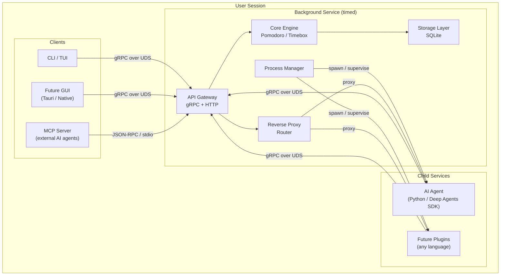
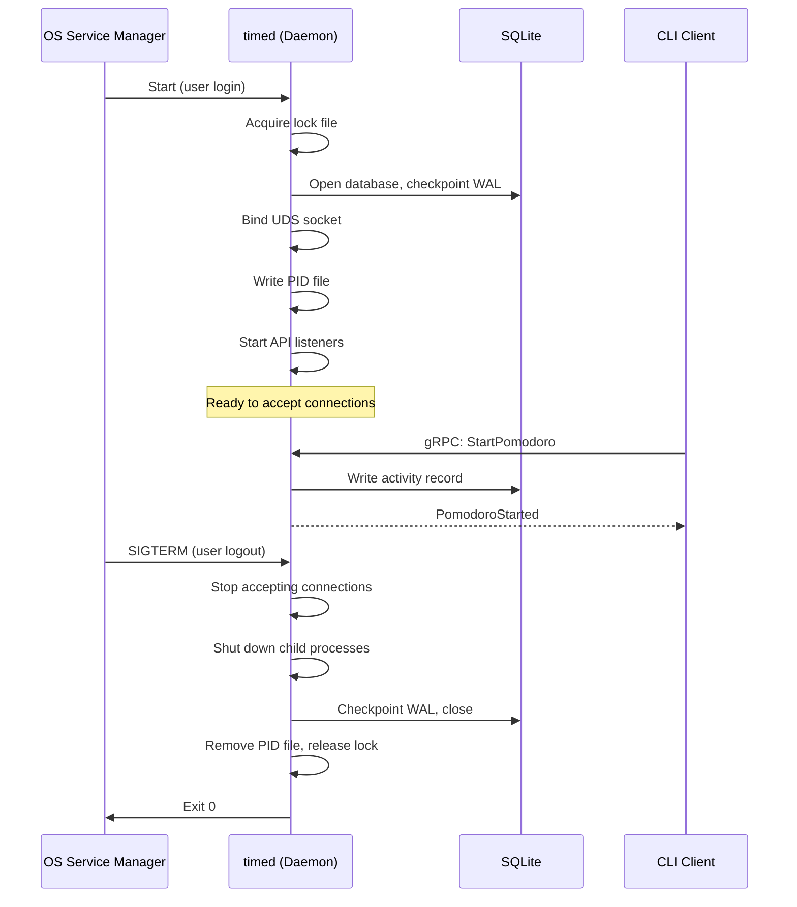
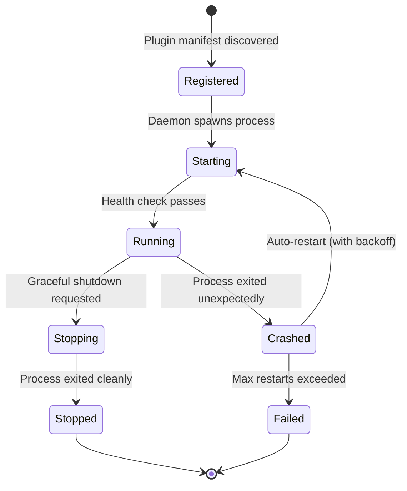
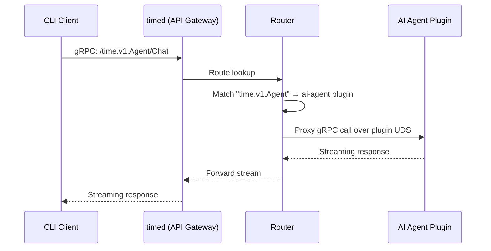

<!--
Copyright 2026 Michael F. Collins, III
Licensed under the Naked Time Source-Available Temporary License
See LICENSE.md for license terms.
-->

# ADR-0001: System Architecture

- **Status:** Accepted
- **Date:** 2026-04-12
- **Author:** Ripley (Lead / Architect)

## Context

Naked Time is a Pomodoro-based time management productivity application that
runs locally on a user's computer. The product requires a persistent background
service (daemon) that starts when the user logs in and runs until logout. Client
applications — starting with a CLI/TUI and potentially expanding to GUI clients
— communicate with this daemon over local IPC. The architecture must support
future extensibility including AI agent integration (via the LangChain Deep
Agents SDK in Python), child process plugins written in arbitrary languages, and
external integrations via MCP (Model Context Protocol) servers.

The product targets three operating systems across multiple architectures:

- **macOS:** Intel x64, Apple Silicon ARM64
- **Linux:** x64/AMD64 and ARM64, both glibc and musl
- **Windows 11:** x86 (32-bit), x64/AMD64, ARM64

This ADR establishes the foundational system architecture that all subsequent
design and implementation decisions will build upon.

## Decision

### 1. System Overview

Naked Time is composed of three primary architectural layers:

1. **The Daemon (`timed`)** — a user-scoped background service that owns all
   state, manages child processes, and exposes APIs over Unix domain sockets.
2. **Client Applications** — CLI/TUI (and future GUI) applications that connect
   to the daemon via its API surface.
3. **Child Services (Plugins)** — optional processes spawned and supervised by
   the daemon that extend its API surface (e.g., an AI agent written in Python).



### 2. Background Service Architecture

#### 2.1 Daemon Identity

The daemon binary is named `timed`. It is a single, long-running process that
operates within the user's session scope — it does not require root or
administrator privileges.

#### 2.2 Lifecycle: Auto-Start and Shutdown

The daemon must start automatically when the user logs in and shut down
gracefully when the user logs out. Each platform provides a native mechanism for
user-scoped service management:

| Platform | Mechanism | Registration |
|----------|-----------|-------------|
| **macOS** | `launchd` user agent | `~/Library/LaunchAgents/com.mfcollins3.timed.plist` |
| **Linux** | `systemd` user service | `~/.config/systemd/user/timed.service` |
| **Windows 11** | Task Scheduler (user logon trigger) | Registered via `schtasks` or COM API |

**macOS (`launchd`):** A property list defines the daemon as a user agent with
`RunAtLoad: true` and `KeepAlive: true`. The `launchd` subsystem handles
starting, stopping, and crash recovery natively. The socket path is specified
in the plist. This is the most capable and integrated option on macOS.

**Linux (`systemd` user services):** A unit file under
`~/.config/systemd/user/` with `Type=notify` (or `Type=simple`) and
`WantedBy=default.target`. The user enables the service with
`systemctl --user enable timed`. Systemd provides restart policies
(`Restart=on-failure`), logging via journald, and socket activation if desired.

**Windows 11 (Task Scheduler):** A scheduled task with a logon trigger runs the
daemon as the current user. The task is configured with:
- Trigger: "At log on" for the specific user
- Action: Start `timed.exe`
- Settings: "If the task fails, restart every 1 minute" (crash recovery)
- "Run whether user is logged on or not" is NOT used — the daemon is
  session-scoped

An installer or `time setup` CLI command will register the appropriate
platform-specific service definition during initial setup.

#### 2.3 Process Supervision and Crash Recovery

The platform service managers (`launchd`, `systemd`, Task Scheduler) provide
primary crash recovery. Additionally, the daemon itself implements:

- **Graceful shutdown** on SIGTERM (Unix) / console control handler (Windows)
- **PID file** at `~/.mfcollins3/time/timed.pid` to detect stale instances
- **Lock file** to prevent concurrent daemon instances
- **Startup self-check** that validates the data directory and recovers from
  incomplete shutdowns (e.g., WAL checkpoint on SQLite)



### 3. Data Storage

#### 3.1 Storage Location

All user data is stored under `~/.mfcollins3/time/`. This path is resolved
using platform-appropriate home directory detection:

| Platform | Resolution |
|----------|-----------|
| macOS / Linux | `$HOME/.mfcollins3/time/` |
| Windows | `%USERPROFILE%\.mfcollins3\time\` |

Directory structure:

```
~/.mfcollins3/time/
├── timed.pid           # Daemon PID file
├── timed.lock          # Instance lock file
├── timed.sock          # Unix domain socket (or named pipe path)
├── data/
│   └── time.db         # Primary SQLite database
├── logs/
│   └── timed.log       # Daemon log (rotated)
├── plugins/
│   └── ai-agent/       # Plugin working directories
└── config/
    └── config.toml     # User configuration
```

#### 3.2 Database: SQLite

SQLite is the primary data store. It is the correct choice for this product:

- **Single-user, local-only** — no concurrent access from multiple machines
- **Zero configuration** — no server process, no network, no administration
- **Cross-platform** — works identically on all target platforms
- **Embedded** — compiles directly into the Go binary via `modernc.org/sqlite`
- **ACID transactions** — full durability with WAL mode
- **Small footprint** — appropriate for a background service

SQLite is used in WAL (Write-Ahead Logging) mode for concurrent read access
from the daemon and any diagnostic tooling, with a single writer (the daemon).

The `modernc.org/sqlite` package is a C-to-Go transpilation of SQLite — pure
Go, no CGO required. It compiles directly into the binary, eliminating any
system dependency on SQLite versions and preserving Go's simple cross-compilation
story.

#### 3.3 Configuration: TOML

User configuration is stored in `config/config.toml`. TOML is human-readable,
well-supported in Go (`BurntSushi/toml` package), and appropriate for a config
file that users may edit by hand.

### 4. IPC & API Layer

#### 4.1 Transport: Unix Domain Sockets

**Decision: Use Unix domain sockets (AF_UNIX) on all platforms, including
Windows 11.**

Windows 11 has supported AF_UNIX since the Windows 10 October 2018 Update
(build 17063). All Windows 11 builds include full AF_UNIX support. The
implementation covers `SOCK_STREAM` and provides the core functionality needed
for gRPC transport: reliable, ordered, bidirectional byte streams.

**Analysis — UDS vs Named Pipes:**

| Criterion | Unix Domain Sockets | Named Pipes |
|-----------|-------------------|-------------|
| Cross-platform API | Identical API on all 3 OSes | Completely different API on Windows vs. Unix |
| gRPC ecosystem support | Go's `google.golang.org/grpc` supports UDS natively on all platforms via `net.Listen("unix", path)` | Requires custom transport implementation |
| HTTP/2 compatibility | Full HTTP/2 over UDS — standard gRPC transport | Named pipes are not stream-oriented in the same way; HTTP/2 framing is awkward |
| Performance | Kernel-level IPC, no TCP overhead | Comparable, but Windows named pipes add kernel mode transitions |
| Security | Filesystem permissions on socket file | Windows ACLs on pipe name |
| Simplicity | One code path, one abstraction | Two completely different code paths |

**The decisive factor is code path unification.** Named pipes would require a
completely separate transport abstraction, separate connection management, and
platform-specific gRPC integration. UDS lets us write one IPC layer that works
on macOS, Linux, and Windows 11 with minimal platform-specific code.

**Windows 11 UDS limitations that do NOT affect us:**
- No `SOCK_DGRAM` (we use `SOCK_STREAM`)
- No `SCM_RIGHTS` / file descriptor passing (we don't need this)
- No abstract namespace sockets (we use filesystem-path sockets)

**Go UDS on Windows:** Go's standard library `net` package supports
`net.Listen("unix", path)` and `net.Dial("unix", path)` on Windows natively.
No third-party shims or platform-specific adapters are required.

**Socket location:** `~/.mfcollins3/time/timed.sock`

On Windows, the path is `%USERPROFILE%\.mfcollins3\time\timed.sock`.

#### 4.2 Primary Protocol: gRPC

gRPC is the primary protocol for all operational APIs (Pomodoro management,
activity tracking, timebox operations, status queries). gRPC provides:

- **Strong typing** via Protocol Buffers — API contracts are explicit, versioned,
  and generate client code in any language
- **Bidirectional streaming** — essential for real-time timer updates and event
  subscriptions
- **HTTP/2 multiplexing** — multiple concurrent RPCs over a single UDS
  connection
- **Ecosystem maturity** — `google.golang.org/grpc` is the reference gRPC
  implementation, and gRPC clients exist for every language our child processes
  might use

Proto definitions live under `proto/` at the repository root and are organized
by service domain:

```
proto/
├── time/v1/
│   ├── pomodoro.proto      # Pomodoro service
│   ├── activity.proto      # Activity management
│   ├── timebox.proto       # Timeboxing service
│   ├── system.proto        # Daemon health, status, shutdown
│   └── plugin.proto        # Plugin registration and lifecycle
```

#### 4.3 Multiple API Services

All gRPC services are multiplexed over a single UDS connection using standard
gRPC service routing (the HTTP/2 `:path` pseudo-header includes the fully
qualified service name, e.g., `/time.v1.Pomodoro/Start`). There is no need for
multiple sockets or port multiplexing — this is a core strength of gRPC over
HTTP/2.

The daemon's API surface is a single `grpc.Server` that registers multiple
service implementations:

```go
server := grpc.NewServer()
pb.RegisterPomodoroServer(server, pomodoroSvc)
pb.RegisterActivityServer(server, activitySvc)
pb.RegisterTimeboxServer(server, timeboxSvc)
pb.RegisterSystemServer(server, systemSvc)
pb.RegisterPluginServer(server, pluginSvc)
server.Serve(udsListener)
```

#### 4.4 Future: HTTP/REST API (OpenAPI Responses API)

For the AI agent integration and potential third-party access, the daemon will
expose an HTTP/REST endpoint alongside gRPC. This is achievable by:

1. **Running a separate HTTP listener** (via Go's `net/http` standard library)
   on a second UDS or on the same socket with protocol detection (H2 for gRPC,
   H1 for REST).
2. **Implementing the OpenAI Responses API format** (`POST /v1/responses`) for
   AI agent interactions. This uses the `input` array with typed content blocks,
   tool definitions, and `store` + `previous_response_id` for conversation
   state.

The HTTP layer is additive — it does not replace gRPC for core operations. It
serves as the interface between the daemon and the AI agent child process, and
as a future external integration surface.

#### 4.5 Future: MCP Server

The daemon will expose an MCP (Model Context Protocol) server for integration
with external AI agents (e.g., GitHub Copilot, Claude, Cursor). The MCP server:

- Uses **JSON-RPC 2.0** over **stdio** (for local tool invocations by MCP
  hosts) or over **HTTP + SSE** (Streamable HTTP transport for remote access).
- Exposes Naked Time operations as **MCP tools** (e.g., `start_pomodoro`,
  `get_active_timer`, `list_activities`).
- Exposes user data as **MCP resources** (e.g., today's activity log, pomodoro
  history).
- The MCP server binary is a separate executable (`time-mcp`) that itself
  connects to the daemon via gRPC over UDS. It acts as a bridge: MCP protocol
  on the outside, gRPC client on the inside.

This separation ensures the MCP protocol surface area doesn't pollute the
daemon's core. The MCP server is a thin translation layer.

### 5. Child Process / Plugin Architecture

#### 5.1 Design Philosophy

The daemon acts as a **process supervisor and API gateway** for child services.
Child services are optional, independently deployed processes that extend the
daemon's capabilities. The first planned child service is the AI agent (Python).

Plugins are language-agnostic. Any process that speaks gRPC can be a plugin.

#### 5.2 Plugin Lifecycle



1. **Registration:** Plugins are declared in the daemon's configuration or
   discovered from the `~/.mfcollins3/time/plugins/` directory. Each plugin
   has a manifest file (`plugin.toml`) that declares:
   - Binary path and arguments
   - API routes it handles (gRPC service names or HTTP path prefixes)
   - Resource requirements and restart policy
   - Health check endpoint

2. **Spawning:** The daemon's Process Manager spawns the child process using
   `os/exec.Command`. The daemon passes configuration to the child via:
   - Environment variables (socket path, data directory, log level)
   - A dedicated UDS for child-to-daemon communication
   - A dedicated UDS that the child listens on for proxied requests

3. **Health Checking:** The daemon periodically calls a `Health` gRPC method
   on the child's socket (using the standard gRPC health checking protocol,
   `grpc.health.v1.Health`). A child that fails health checks is restarted
   with exponential backoff.

4. **Graceful Shutdown:** On daemon shutdown, all children receive a shutdown
   signal (via gRPC `Shutdown` RPC, then SIGTERM, then SIGKILL after timeout).

#### 5.3 Communication Protocol

Children communicate with the daemon and with clients through gRPC over UDS.
Each child gets its own socket:

```
~/.mfcollins3/time/plugins/
├── ai-agent/
│   ├── plugin.toml         # Manifest
│   ├── plugin.sock         # Child's API socket
│   └── ...                 # Plugin working files
```

The daemon does NOT use stdin/stdout for plugin communication. gRPC over UDS is
preferred because:

- It provides a typed, versioned contract (protobuf)
- It supports streaming (critical for AI agent responses)
- It works the same way as all other IPC in the system
- Child processes can also call daemon APIs (e.g., to read user data)

#### 5.4 Reverse Proxy / API Routing

When a client makes a request that targets a plugin's API surface, the daemon's
Router component proxies the request to the appropriate child process:



The routing table is built from plugin manifests at startup and updated when
plugins are registered or unregistered at runtime. The daemon uses gRPC
interceptors and a custom routing layer to forward requests based on the gRPC
service name.

For HTTP routes (e.g., the Responses API), the daemon uses Go's `net/http`
multiplexer to forward matching paths to the child's HTTP socket.

### 6. Future AI Agent Integration

#### 6.1 Architecture

The AI agent is a Python child process that uses the **LangChain Deep Agents
SDK**. Deep Agents is an "agent harness" built on LangGraph that provides:

- **Task planning and decomposition** via a built-in `write_todos` tool
- **File system tools** for context management (offloading large context)
- **Subagent spawning** for context isolation on specialized subtasks
- **Pluggable backends** (in-memory, local disk, LangGraph store)
- **Auto-summarization** to manage context window across long sessions
- **Provider-agnostic model support** (OpenAI, Anthropic, Azure, Google, etc.)

The agent is created via `create_deep_agent()` with custom tools that call back
into the daemon's gRPC API to access user data (activities, pomodoros, timebox
schedules) and perform actions.

#### 6.2 Communication Flow

```
┌──────────┐    gRPC/UDS     ┌───────────┐    gRPC/UDS     ┌────────────┐
│  Client   │ ──────────────► │   timed   │ ──────────────► │  AI Agent  │
│ (CLI/TUI) │ ◄────stream──── │  (daemon) │ ◄────stream──── │  (Python)  │
└──────────┘                  └───────────┘                  └────────────┘
                                    │                              │
                                    │  gRPC/UDS (agent calls back  │
                                    │◄─────────────────────────────│
                                    │  to read user data, perform  │
                                    │  actions)                    │
```

The AI agent exposes:
- A gRPC service for structured operations (e.g., `AnalyzeProductivity`,
  `SuggestSchedule`)
- An HTTP endpoint implementing the OpenAI Responses API format for
  conversational interaction

The AI agent consumes:
- The daemon's gRPC APIs as custom Deep Agents tools (wrapped as Python
  functions that call gRPC stubs)
- User configuration for model provider and API keys

#### 6.3 Why a Separate Process

The AI agent runs as a separate Python process rather than embedded in the Go
daemon because:

1. **Language ecosystem** — Deep Agents SDK is Python-only. The LangChain /
   LangGraph ecosystem, model integrations, and tooling are all Python-native.
2. **Isolation** — AI agent crashes or memory leaks don't affect the daemon.
3. **Resource management** — Python's memory footprint and GIL behavior are
   isolated from the daemon's goroutine scheduler.
4. **Independent deployment** — The agent can be updated independently of the
   daemon. Users who don't want AI features don't need Python installed.
5. **Model flexibility** — The Deep Agents SDK supports arbitrary model
   providers. This flexibility is better served by Python's dynamic nature.

### 7. Implementation Language: Go

**Decision: Implement the daemon, CLI/TUI, and MCP server in Go. The AI agent
remains Python.**

The product owner has confirmed that Naked Time may be polyglot — there is no
requirement that all components use the same language. The AI agent is already
Python. This section evaluates Go and Rust on technical merit for the daemon and
CLI, and recommends the best tool for each component.

#### 7.1 Go vs Rust Analysis

| Criterion | Go | Rust |
|-----------|-----|------|
| **Daemon lifecycle** | `kardianos/service` provides cross-platform service management (launchd, systemd, Windows Service) out of the box. `os/signal` and `context` cancellation are idiomatic for graceful shutdown. Go was designed for servers. | `proc-daemon`, `signal-hook`, Tokio shutdown — all work but require more manual wiring. More control, but more assembly required for standard daemon patterns. |
| **gRPC ecosystem** | `google.golang.org/grpc` — the reference implementation. Most mature gRPC ecosystem. Protobuf codegen is first-class. | `tonic` — production-grade, fully async, excellent quality. Younger ecosystem but covers all requirements at this scale. |
| **Cross-platform UDS** | `net.Listen("unix", path)` works on macOS, Linux, and Windows with zero platform-specific code. | `tokio::net::UnixListener` on Unix; `uds_windows` crate on Windows. Requires a platform shim and custom adapter for Tonic. |
| **Cross-compilation** | `GOOS=linux GOARCH=arm64 go build` — native to the toolchain. No Docker, no QEMU, no additional tooling. Trivial CI matrix for 9 targets. | `cargo cross` (Docker + QEMU) or `cargo-zigbuild` for Linux/musl. More complex CI configuration. |
| **Concurrency model** | Goroutines and channels are built-in. No runtime to configure. Simple, predictable concurrency for daemon work: timer management, gRPC serving, child process supervision. | Tokio async/await is powerful but adds complexity: async function coloring, `Pin`, runtime configuration, cancellation semantics. More power than this workload demands. |
| **Static binaries** | Static by default when using pure-Go dependencies. With `modernc.org/sqlite` (pure-Go SQLite), no CGO required. | Fully static via musl on Linux. Requires musl toolchain setup for cross-compilation. |
| **SQLite** | `modernc.org/sqlite` — C-to-Go transpilation of SQLite. Pure Go, no CGO, works on all platforms. | `rusqlite` with `bundled` feature. Statically links C SQLite. Excellent quality. |
| **TUI frameworks** | `bubbletea` (Charm ecosystem) — Elm architecture, excellent community, beautiful defaults. `lipgloss` for styling, `bubbles` for components. | `ratatui` — lower-level, more control, actively maintained. Excellent for complex TUIs. |
| **Resource usage** | GC-managed. ~5–10 MB RSS for a simple daemon. GC pauses <1 ms in modern Go. For a timer daemon with occasional gRPC calls, overhead is imperceptible. | No GC, deterministic memory. ~1–2 MB RSS. Theoretical winner — but the difference is invisible for this workload. |
| **Compile-time safety** | Memory safe (GC). Data races are possible but caught by the race detector at test time. Simpler concurrency model reduces the surface for races. | Memory safe, thread safe, data race-free at compile time. Strongest safety story. |
| **Developer experience** | Gentle learning curve. Most developers productive in days. Built-in tooling (`go test`, `go vet`, `gopls`). Fast compilation. | Steep learning curve (ownership, borrowing, lifetimes). Slower compilation. Excellent error messages and IDE support. |

#### 7.2 Why Go Wins for This Project

1. **Right-sized concurrency.** The daemon manages Pomodoro timers, handles
   occasional gRPC calls from the CLI, supervises child processes, and writes
   to SQLite. Goroutines and channels are purpose-built for this workload.
   Tokio's async runtime is more powerful than we need, and that unused power
   becomes accidental complexity.

2. **Cross-platform simplicity.** `net.Listen("unix", path)` works on all
   three platforms with zero platform-specific code. Go's UDS support on
   Windows is built into the standard library. Rust requires the `uds_windows`
   crate plus a custom Tonic adapter — bounded work, but work that Go
   eliminates entirely.

3. **Build simplicity for 9 targets.** `GOOS` and `GOARCH` environment
   variables handle all cross-compilation natively. No Docker, no QEMU, no
   zigbuild. The CI matrix is a simple set of environment variable
   combinations. This is a meaningful reduction in build infrastructure
   complexity across the project's lifetime.

4. **gRPC reference implementation.** Go's gRPC library is maintained by the
   gRPC team themselves. At our scale this advantage is modest — Tonic is
   excellent — but it means fewer surprises and better documentation for
   protocol edge cases we encounter over time.

5. **Daemon lifecycle tooling.** Go has mature, well-tested libraries for
   cross-platform service management (`kardianos/service`), signal handling,
   and graceful shutdown patterns. The language was designed for building
   servers and services.

6. **Contributor accessibility.** Go's learning curve is meaningfully lower
   than Rust's. If the project needs to onboard contributors, they can be
   productive in Go within days. Rust's ownership model takes weeks to months
   to internalize. For a small-team project, this matters.

#### 7.3 Why Not Rust

Rust is a credible alternative. Its compile-time safety guarantees are stronger
than Go's. The evaluation below explains why each Rust advantage, while real,
is not decisive for this project:

- **Resource efficiency is noise for this workload.** The daemon is a timer
  app, not a high-throughput server. The difference between 2 MB and 8 MB RSS
  is invisible to the user. Go's GC pauses (<1 ms) are imperceptible for a
  process that handles a handful of requests per minute.

- **Compile-time data race prevention is valuable but not decisive.** Go's
  race detector catches races at test time. The daemon's concurrency pattern
  is straightforward — a few goroutines managing timers and gRPC — not a
  complex concurrent system where Rust's compile-time guarantees provide
  outsized value.

- **Tokio is more power than we need.** Tokio's async runtime is designed for
  high-concurrency network servers. A Pomodoro daemon does not need async I/O
  multiplexing at that level. Goroutines are simpler and sufficient.

- **Build complexity taxes the entire development lifecycle.** Rust's
  cross-compilation story, while workable, adds CI/CD complexity that Go
  avoids entirely. Over the life of the project, this compounds.

#### 7.4 Component Language Assignment

| Component | Language | Rationale |
|-----------|----------|-----------|
| `timed` (daemon) | Go | Best daemon tooling, simplest cross-platform story |
| `time-cli` (CLI/TUI) | Go | Shared types with daemon, bubbletea/Charm ecosystem |
| `time-mcp` (MCP server) | Go | Thin bridge; shares gRPC stubs with daemon |
| `time-core` (domain logic) | Go | Shared library used by daemon, CLI, and MCP server |
| `time-proto` (protobuf) | Go (generated) | Standard gRPC/protobuf codegen |
| AI agent (plugin) | Python | LangChain Deep Agents SDK is Python-native |

The CLI shares generated gRPC stubs and domain types with the daemon. Using the
same language eliminates type duplication, simplifies the build, and means
contributors need only one toolchain (plus Python for AI) for the core product.

### 8. Cross-Platform Build Strategy

#### 8.1 Build Targets

| Target | OS | Arch | libc | Notes |
|--------|-----|------|------|-------|
| `darwin/amd64` | macOS | x64 | system | Intel Macs |
| `darwin/arm64` | macOS | ARM64 | system | Apple Silicon |
| `linux/amd64` (glibc) | Linux | x64 | glibc | Standard Linux |
| `linux/arm64` (glibc) | Linux | ARM64 | glibc | ARM Linux (RPi, cloud) |
| `linux/amd64` (musl) | Linux | x64 | musl | Static binary (Alpine) |
| `linux/arm64` (musl) | Linux | ARM64 | musl | Static binary |
| `windows/386` | Windows | x86 | MSVC | 32-bit Windows |
| `windows/amd64` | Windows | x64 | MSVC | 64-bit Windows |
| `windows/arm64` | Windows | ARM64 | MSVC | ARM Windows |

Total: **9 build targets.**

#### 8.2 Build Tooling

Go's cross-compilation is native to the toolchain:

```bash
# Cross-compile for any target — no Docker, no QEMU
GOOS=linux GOARCH=arm64 go build -o timed ./cmd/timed
GOOS=windows GOARCH=amd64 go build -o timed.exe ./cmd/timed
```

- **Standard targets** (macOS, Windows, Linux glibc): `GOOS` + `GOARCH` only.
  No CGO required when using `modernc.org/sqlite`.
- **Linux musl targets:** With `CGO_ENABLED=0` (the default for
  cross-compilation) and `modernc.org/sqlite`, the resulting binary is fully
  static. For explicit musl linking, build in an Alpine container or use
  `CC=musl-gcc CGO_ENABLED=1`.
- **macOS universal binary:** Build `darwin/amd64` and `darwin/arm64`
  separately, then combine with `lipo -create -output timed timed-amd64
  timed-arm64`.
- **GitHub Actions** as the CI/CD platform, with a matrix build across all
  targets. Each target is a single `go build` invocation.

#### 8.3 Platform-Specific Code Isolation

Platform-specific code is isolated behind Go build tags:

```
internal/
├── platform/
│   ├── platform.go            # Platform interface definitions
│   ├── platform_darwin.go     # launchd integration
│   ├── platform_linux.go      # systemd integration
│   ├── platform_windows.go    # Task Scheduler integration
│   └── platform_unix.go       # Shared Unix code (macOS + Linux)
```

Go's build tag system (`//go:build darwin`, `//go:build windows`, etc.)
automatically selects the correct platform implementation at compile time. A
`Platform` interface abstracts:

- Service registration (install/uninstall daemon)
- Socket creation and binding
- Home directory resolution
- Signal handling

#### 8.4 Module Structure

The repository uses a Go module:

```
go.mod                        # Module root
├── cmd/
│   ├── timed/                # Daemon binary (main package)
│   ├── time-cli/             # CLI / TUI binary (main package)
│   └── time-mcp/             # MCP server binary (main package)
├── internal/
│   ├── core/                 # Shared domain logic
│   ├── platform/             # Platform abstraction (build-tagged)
│   └── transport/            # IPC transport abstraction
├── pkg/
│   └── proto/                # Generated protobuf/gRPC code
├── proto/                    # Protocol Buffer definitions (.proto files)
├── plugins/
│   └── ai-agent/             # Python AI agent plugin
└── docs/
    └── adrs/                 # Architectural Decision Records
```

## Consequences

### Positive

- **Unified IPC** — A single transport mechanism (UDS + gRPC) across all
  platforms eliminates platform-specific API divergence.
- **Extensibility** — The plugin architecture allows the product to grow
  without monolithic coupling. New features can be added as child processes in
  any language.
- **Resource efficiency** — Go's lightweight goroutine scheduler and modest
  memory footprint keep the daemon invisible to the user. For a timer daemon
  with occasional gRPC calls, resource usage is negligible.
- **Strong contracts** — gRPC + protobuf enforces explicit, versioned API
  contracts between all components.
- **Future-proof** — The architecture accommodates AI agents, MCP servers, GUI
  clients, and third-party integrations without structural changes.

### Negative

- **GC overhead** — Go's garbage collector adds a small, fixed overhead
  compared to a GC-free language like Rust. For this workload (a timer daemon),
  the overhead is imperceptible (<1 ms pauses, ~5–10 MB RSS), but it exists.
- **No compile-time data race prevention** — Go's race detector is runtime-
  only. Data races are possible in concurrent code. Mitigation: use the race
  detector in all tests (`go test -race`) and keep the concurrency model
  simple.
- **Python dependency for AI** — Users who want AI features must have Python
  installed. The daemon itself has no runtime dependencies, but the AI plugin
  does.
- **Complexity budget** — The plugin architecture, reverse proxy, and multi-
  protocol API surface are significant complexity. We must be disciplined about
  when to build each layer (not all at once).

### Risks

- **Windows 11 UDS edge cases** — While AF_UNIX is supported, there may be
  undiscovered edge cases in Windows' implementation. Go's standard library
  handles UDS natively on Windows, which reduces (but does not eliminate) risk.
  Mitigation: comprehensive integration tests on Windows, and a documented
  escape hatch to TCP localhost if UDS proves unreliable.

## Alternatives Considered

### Named Pipes on Windows

Using Windows named pipes instead of UDS would leverage a native Windows IPC
mechanism. However, named pipes have a completely different API, require a
separate transport implementation for gRPC, and would force us to maintain two
IPC code paths. Windows 11's AF_UNIX support is mature enough for our needs,
and code path unification outweighs the marginal benefits of named pipes.

### TCP Localhost as Fallback

Using `127.0.0.1:port` for IPC would be the simplest cross-platform option.
However, it exposes the API to any process on the machine (even with localhost
binding), requires port allocation and conflict management, and loses the
filesystem-permission-based security of UDS. TCP remains available as a
documented escape hatch if UDS proves unreliable on Windows.

### Rust Instead of Go

Rust is a credible alternative for this project. Its compile-time safety
guarantees (ownership, borrowing, data race prevention) are stronger than Go's.
It has no garbage collector, giving it a theoretical edge in resource efficiency
for long-running processes. However, for a Pomodoro timer daemon — a low-
throughput service handling occasional gRPC calls and SQLite writes — Rust's
strengths provide marginal benefit while its complexity (steeper learning curve,
Tokio async runtime, cross-compilation tooling, Windows UDS shim) adds real
cost. Go's simplicity, native cross-compilation, stdlib UDS support, and
reference gRPC implementation make it the better fit for this workload. See
Section 7 for the full analysis.

### Embedded Python

Instead of a child process, the AI agent could be embedded directly into the
Go daemon (e.g., via cgo + embedded Python or a WASM-based approach). This was
rejected because: (1) it couples the daemon's lifecycle to the Python runtime
and GIL, (2) a Python crash could take down the daemon, (3) it complicates the
build for users who don't want AI features, and (4) it eliminates the ability
to update the agent independently.

## References

- [google.golang.org/grpc — Go gRPC](https://pkg.go.dev/google.golang.org/grpc)
- [modernc.org/sqlite — Pure Go SQLite](https://pkg.go.dev/modernc.org/sqlite)
- [bubbletea — Go TUI Framework](https://github.com/charmbracelet/bubbletea)
- [Charm ecosystem (lipgloss, bubbles)](https://charm.sh/)
- [kardianos/service — Cross-platform service management](https://github.com/kardianos/service)
- [BurntSushi/toml — Go TOML parser](https://github.com/BurntSushi/toml)
- [LangChain Deep Agents SDK](https://docs.langchain.com/oss/python/deepagents/overview)
- [MCP Specification](https://modelcontextprotocol.io/specification/)
- [OpenAI Responses API](https://developers.openai.com/api/reference/responses/overview)
- [Windows AF_UNIX Support](https://devblogs.microsoft.com/commandline/af_unix-comes-to-windows/)
